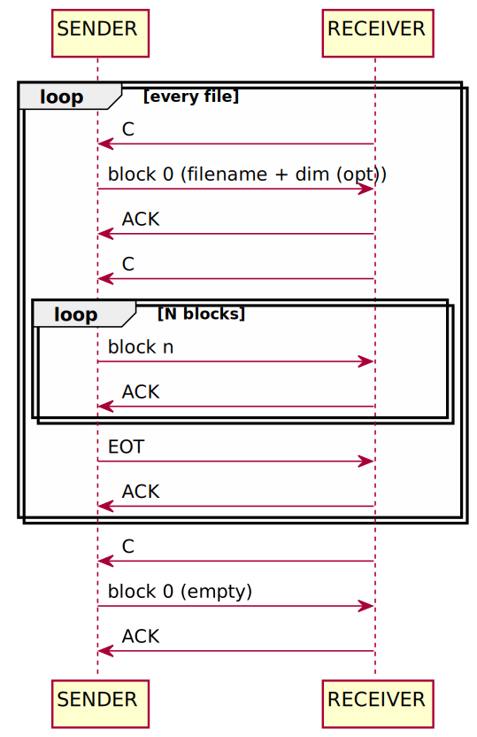

# Yet Another YModem

This project was born out of a need to have an implementation of YModem that was suitable for bare-metal embedded environments and that had a license that would allow it to be used freely.

## Implemntation

This implementation is based on the [XMODEM/YMODEM PROTOCOL REFERENCE](http://gallium.inria.fr/~doligez/zmodem/ymodem.txt) specification document.<br>
From this document, the following sequence diagram was made:<br>



The organization of the code takes into account this diagram.

### CRC

CRC sources are in `ymodem/crc` and were generated using [pycrc](https://pycrc.org/index.html).<br>

Sources were created using the following algorithms:<br>

- **bit-by-bit**: slowest but simpler and smallest algoritm, It compute CRC bit by bit
- **bit-by-bit-fast**: like bit-by-bit it compute CRC bit by bit, but is a little faster and not so small.
- **table-driven**: fastest algorithm but also bigger.

The user will be able to choose which of the 3 algorithms to use based on the environment of constraints he will have.


## Usage

The only thing you have to do to integrate YAYModem into your project is to customize the `ymodem_port.*` files.<br>
You also have to provide some other function as callbacks.

Find examples in the `test` directory.

### ry

In the `test/ry` directory you will find a ymodem receiver implementation. In the same directory you will also find a customization of `ymodem_port.*` files.<br>
To test it, `socat` is used to create `pty` serial devices:<br>

- In terminal 1:
  ```
  socat pty,raw,echo=0,link=/tmp/ttyV1 pty,raw,echo=0,link=/tmp/ttyV2
  ```
  this command creates two devices `/tmp/ttyV1` and `/tmp/ttyV2` connected together by `socat`.

- In terminal 2:
  ```
  test/ry/ry </tmp/ttyV2 >/tmp/ttyV2
  ```
  this receives files through `/tmp/ttyV2`

- In terminal 3:
  ```
  sb -b --ymodem some_file </tmp/ttyV1 >/tmp/ttyV1
  ```
  this sends the `some_file` through `/tmp/ttyV1`

## TODO

Currently only reception is implemented. I would like to write sending as well. You can contribute.

## License

This project is covered by the Apache 2.0 license
